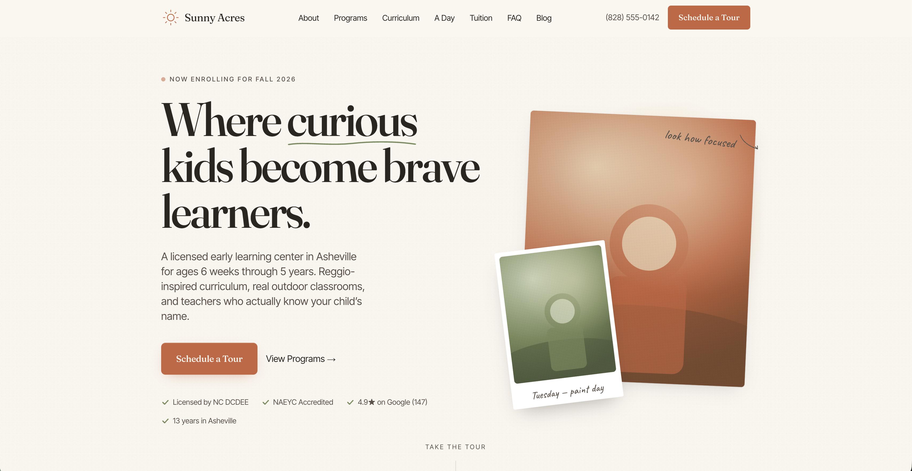

# Sunny Acres — Daycare Website

A multi-page Next.js 14 site for a fictional Reggio-inspired early learning center, built to the spec in [`DESIGN.md`](./DESIGN.md).



## Stack

- **Next.js 14** (App Router) · **TypeScript** · **Tailwind CSS**
- **Framer Motion** — scroll reveals
- **React Hook Form + Zod** — multi-step tour form
- **`next/font`** — Fraunces (display), Inter Tight (body), Caveat (handwritten accents)

## Run it

```bash
npm install
npm run dev      # http://localhost:3000
npm run build    # production build (23 static pages)
npm run start    # serve the production build
npm run typecheck
```

## Routes

| Route | Notes |
| --- | --- |
| `/` | Hero, why-us triad, day-in-life strip, programs grid, testimonial, CTA band |
| `/about` | Founder story, timeline, values, accreditations |
| `/programs` | Overview + comparison table |
| `/programs/[slug]` | `infants`, `toddlers`, `preschool`, `pre-k` (statically generated) |
| `/staff` | Team grid, hover-to-reveal candid photo |
| `/curriculum` | Long-form editorial layout |
| `/a-day` | Hour-by-hour, alternating timeline |
| `/tuition` | Transparent pricing table |
| `/tour` | 3-step form (RHF + Zod, honeypot, success state) |
| `/faq` | Search + category filter + accordion |
| `/blog` | Featured + 3-col grid + newsletter |
| `/contact` | Form, map placeholder, directions |
| `/careers` · `/privacy` · `/accessibility` · `/sitemap.xml` · `/robots.txt` | |

## Project layout

```
app/         App Router pages, sitemap, robots, globals.css
components/  Nav, footer, CTA band, motion wrappers, forms, accordion, icons
lib/         Site constants and program data
```

## What's stubbed

Designed to be production-ready in shape, but these integrations need real credentials before launch:

- Tour & contact form submission (Resend email + GoHighLevel webhook)
- Calendly embed on `/tour`
- GA4 / Meta Pixel via GTM
- Google Maps embed on `/contact`
- Photography — `components/photo.tsx` renders a warm, grain-textured placeholder with five palette variants. Replace with `next/image` once final assets land.
